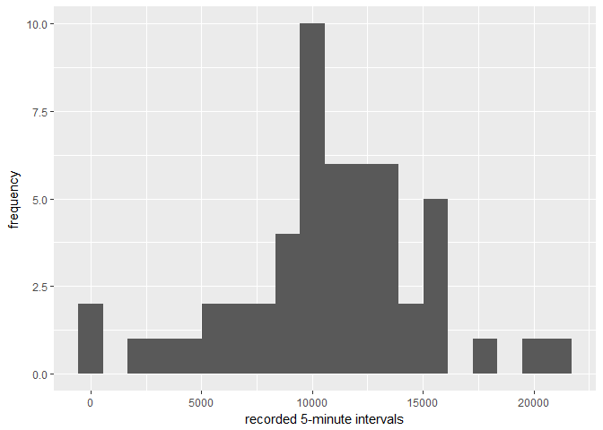
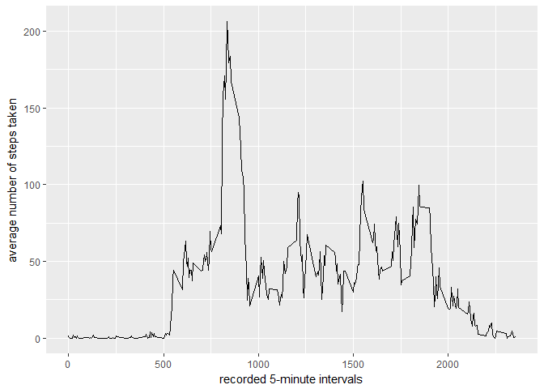
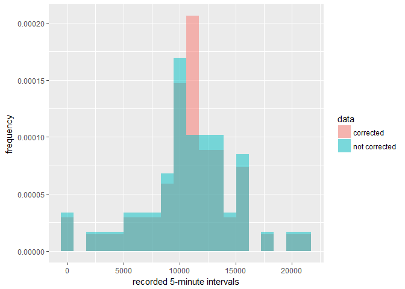
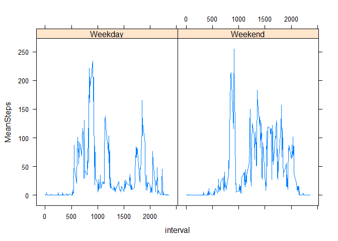

## Loading and preprocessing the data
Here the data is loaded, making sure that the date column is automatically read by R as dates in the format YYYY-MM-DD. The Steps and Interval columns are classed as numeric values.

```r
library(readr)
activity <- read_csv("~/GitHub/RepData_PeerAssessment1/activity.zip", 
                     col_types = cols(date = col_date(format = "%Y-%m-%d"), 
                                      interval = col_number(), steps = col_number()), 
                     na = "NA")
```


## What is mean total number of steps taken per day?

```r
library(ggplot2)
#Calcualte the total number of steps each day
SumStepsDay<-aggregate(activity$steps, by=list(Category=activity$date), FUN=sum)

#Remove rows with NA values
SumStepsDay<-na.omit(SumStepsDay)

#create a histogram plot of the total number of steps each day.
ggplot(data=SumStepsDay, aes(SumStepsDay$x)) + 
        geom_histogram(bins=20) +
        xlab("recorded 5-minute intervals") +
        ylab("frequency")
```

<!-- -->

```r
#calculate the mean and median number of steps each day.
meanSteps<-mean(SumStepsDay$x)
medianSteps<-median(SumStepsDay$x)
```

ANSWER: The mean number of steps is 1.0766189\times 10^{4} and the median number of steps is 1.0765\times 10^{4}.

## What is the average daily activity pattern?

```r
library(ggplot2)
library(data.table)

#calculate the mean number of steps taken in each time interval over the recorded days
MeanIntervalSteps<- aggregate(x=list(MeanSteps=activity$steps), by=list(interval=activity$interval), FUN=mean, na.rm=TRUE)

#Create the time interval plot
ggplot(data=MeanIntervalSteps, aes(x=interval, y=MeanSteps)) +
        geom_line() +
        xlab("recorded 5-minute intervals") +
        ylab("average number of steps taken") 
```

<!-- -->

```r
#Look up which interval had the most steps over the recorded duration
maxSteps<-subset(MeanIntervalSteps, MeanSteps==max(MeanIntervalSteps$MeanSteps))

#Extract the value
interval<-maxSteps$interval
steps<-maxSteps$MeanSteps
```
On average the time interval of 835 had the most steps, with an average of 206.1698113.

## Imputing missing values
In the following we replace the missing step data with averages for the relevant time interval calculated across all measured days. We then analyse the difference between the mean and average step values to evaluate the impact of replacing the missing datapoints.


```r
#count the number of missing rows
missing<-nrow(subset(activity, is.na(steps)))

#create a new dataset so we don't mess up the original
df<-activity

#now replace the NA values in the "steps" column with the averages for that time interval
df$steps <- with(df, ave(steps, interval,
    FUN = function(x) replace(x, is.na(x), mean(x, na.rm = TRUE))))

#now we calculate the sum of steps per day again for the new dataset
NewSumStepsDay<-aggregate(df$steps, by=list(Category=df$date), FUN=sum)

#and calcuate the mean and median steps per day again for the corrected data
meanStepsNew<-mean(NewSumStepsDay$x)
medianStepsNew<-median(NewSumStepsDay$x)

#Now to plot the data together let's add a new column called "data" to indicate the corrected data and the uncorrected data - and bind these into one dataset
NewSumStepsDay$data<-"corrected"
SumStepsDay$data<-"not corrected"
activityNew<-rbind(NewSumStepsDay, SumStepsDay)

#Now let's make a new historgram
ggplot(activityNew, aes(x, fill = data)) + 
        geom_histogram(alpha = 0.5, aes(y = ..density..), position = 'identity', bins=20) +
        xlab("recorded 5-minute intervals") +
        ylab("frequency") 
```

<!-- -->

The figure above shows that there is a slight difference between the data that has been corrected for missing values and the original dataset. The mean for the corrected data was 1.0766189\times 10^{4} vs 1.0766189\times 10^{4} for the original data. The median was 1.0766189\times 10^{4} for the corrected vs 1.0765\times 10^{4} for the original data. 

## Are there differences in activity patterns between weekdays and weekends?


```r
library(lattice)
#first we add a column to the data that specifies the relevant day of the week.
df$weekday<-weekdays(df$date)

#Now we class Saturday and Sunday as weekend
df$weekday <- gsub(c("Monday", "Tuesday", "Wednesday", "Thursday", "Friday"),"Weekday",df$weekday)
df$weekday <- gsub(c("Saturday", "Sunday"),"Weekend",df$weekday)

#Now we must calculate mean number of steps for each interval in weekdays vs weekends
WeekdaysIntervals<-subset(df, weekday=="Weekday")
WeekendIntervals<-subset(df, weekday=="Weekend")

#calculate the mean number of steps in each time interval for the weekdays
MeanIntervalStepsWeekdays<- as.data.frame(aggregate(x=list(MeanSteps=WeekdaysIntervals$steps), by=list(interval=WeekdaysIntervals$interval), FUN=mean, na.rm=TRUE))
MeanIntervalStepsWeekdays$Weekday<-"Weekday"

#calculate the mean number of steps in each time interval for the weekends
MeanIntervalStepsWeekend<- as.data.frame(aggregate(x=list(MeanSteps=WeekendIntervals$steps), by=list(interval=WeekendIntervals$interval), FUN=mean, na.rm=TRUE))
MeanIntervalStepsWeekend$Weekday<-"Weekend"

#Combine the two datasets using rbind
total<-rbind(MeanIntervalStepsWeekdays,MeanIntervalStepsWeekend)

#use xyplot from the lattice package to plot two panels
panelPlot<-xyplot(MeanSteps ~ interval | Weekday, data = total, type="l")
panelPlot
```

<!-- -->
